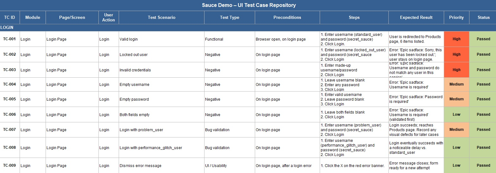
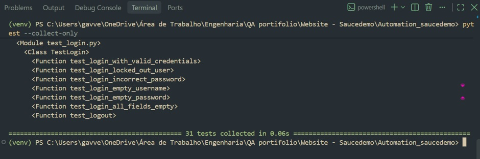
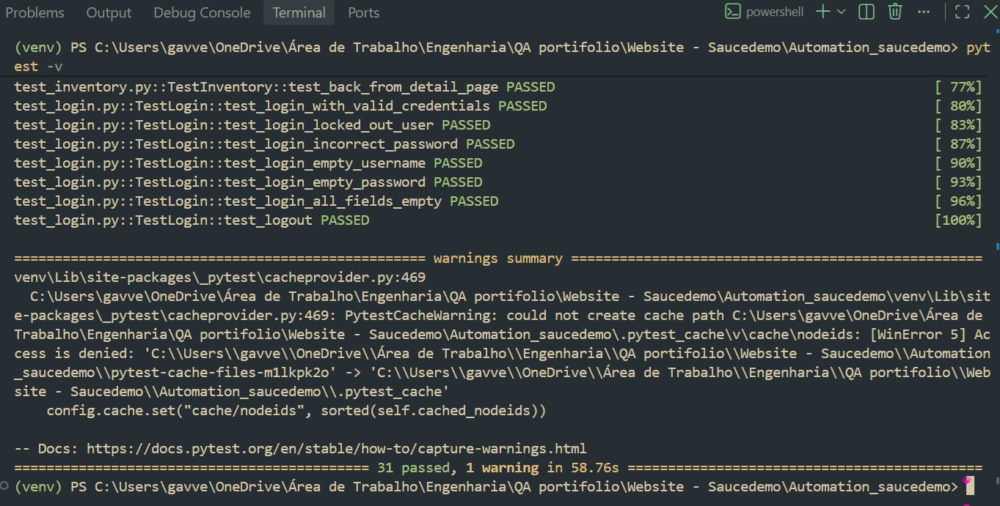
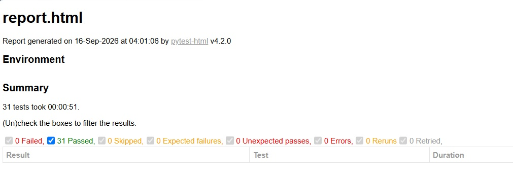
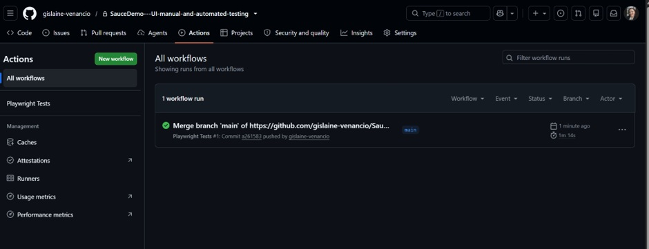

# UI Testing with Pytest & Playwright — SauceDemo


[](https://github.com/gislaine-venancio/SauceDemo---UI-manual-and-automated-testing/actions/workflows/playwright.yml)

Automated end-to-end UI test project built with **Pytest** and **Playwright**, targeting the open source demo e-commerce site **[SauceDemo](https://www.saucedemo.com/)** (Swag Labs). The project started as a full manual test case repository, which was later translated into an automated regression suite covering the same functional flows, and now runs automatically on every push via **GitHub Actions**.

## 🔑 Key Findings

- **31 automated tests, 100% pass rate** (31/31 passed in 58.76s, headless Chromium).
- Coverage spans all four core flows of the application: **Login**, **Product Listing / Inventory**, **Shopping Cart**, and **Checkout**.
- An initial run surfaced 7 flaky failures, all caused by the same root issue: assertions checking the DOM immediately after a page navigation, before the single-page app finished re-rendering. Replacing one-shot `is_visible()` / `count()` checks with Playwright's auto-retrying `expect()` API resolved all of them.
- The suite is wired into **GitHub Actions**: every push or pull request to `main`/`master` triggers a headless run and publishes the HTML report as a downloadable artifact.

## 🎯 Objective

Validate the core user-facing flows of the SauceDemo application — logging in, browsing and sorting products, managing the shopping cart, and completing checkout — first through manual exploratory testing, then through an automated Pytest + Playwright suite that can be re-run on demand as a regression check, both locally and in CI.

## 🛠️ Tools Used

- **[SauceDemo](https://www.saucedemo.com/)** — demo e-commerce site used as the test target
- **Python 3.14**
- **Pytest 9.1.1** — test runner and assertion framework
- **Playwright (sync API)** — browser automation
- **pytest-html** — self-contained HTML test report generation
- **venv** — isolated Python virtual environment
- **GitHub Actions** — CI pipeline that runs the suite automatically on every push/PR

## 🧩 Project Structure

```
Automation_saucedemo/
├── .github/
│   └── workflows/
│       └── playwright.yml   # GitHub Actions CI pipeline
├── conftest.py               # Shared fixtures: browser, page, automatic login
├── test_login.py             # Login flow (7 tests)
├── test_inventory.py         # Product listing, sorting, add/remove (10 tests)
├── test_cart.py               # Shopping cart page (5 tests)
├── test_checkout.py          # Full checkout flow (9 tests)
├── requirements.txt
├── report.html                # Generated locally by pytest-html (not versioned)
└── Images/
    ├── manual-tests-case.jpg
    ├── pytest-collection.jpg
    ├── results-test.jpg
    ├── report-html.jpg
    └── automation-gitactions.jpg
```

### conftest.py
Defines the fixtures shared across every test file: a session-scoped Playwright instance, a fresh headless Chromium `browser` and `page` per test, and a `logged_in_page` fixture that logs in as `standard_user` and lands on the inventory page — used as the starting point for most test cases.

### Test files
- **`test_login.py`** — valid login, locked-out user, incorrect password, empty username, empty password, both fields empty, and logout.
- **`test_inventory.py`** — product list rendering, adding a single/multiple products to the cart, removing a product from the listing page, all four sorting modes (name A–Z/Z–A, price low–high/high–low), opening and returning from a product's detail page.
- **`test_cart.py`** — navigating to the cart, product appearing in the cart, removing a product from the cart page, empty cart state, and "Continue Shopping".
- **`test_checkout.py`** — starting checkout, completing it with valid data, the three required-field validations (first name, last name, postal code), cancelling from both checkout steps, completing a full purchase, and verifying the order total (subtotal + tax = total).

## ✅ Manual Test Case Repository

Before any automation, a full manual test case repository was documented, covering **37 test cases across 5 modules**: Login, Product Listing, Shopping Cart, Checkout Flow, and Logout & Session — each with module, page/screen, user action, scenario, test type, preconditions, steps, expected result, priority, and status.


*Excerpt of the manual test case repository (Login module, TC-001 to TC-009), executed and documented before automation began.*

## 🚀 Automation Steps Performed

### 1. Set up an isolated Python environment
A virtual environment (`venv`) was created for the project, keeping Pytest, Playwright, and pytest-html isolated from the system's global Python installation.

### 2. Wrote the Pytest + Playwright test suite
The manual test cases were translated into 31 automated tests, organized into 4 modules that mirror the application's own structure (login, inventory, cart, checkout).

### 3. Verified test collection
Before running anything for real, `pytest --collect-only` was used to confirm every test was discovered correctly, with no import or syntax errors.

```bash
pytest --collect-only
```


*Terminal output confirming all 31 tests, across the 4 test modules, were collected successfully in 0.06s.*

### 4. Executed the full test suite
```bash
pytest -v
```


*Verbose run showing all 31 tests passing in 58.76s. The single warning shown is a harmless `PytestCacheWarning`, not a test failure — see Notes below.*

### 5. Generated a self-contained HTML report
```bash
pytest -v --html=report.html --self-contained-html
```


*HTML report generated by pytest-html: a filterable, sortable summary showing 31 Passed / 0 Failed, with per-test duration and expandable details for any future failures.*

### 6. Wired the suite into GitHub Actions
A workflow file at `.github/workflows/playwright.yml` runs the full suite automatically on every push and pull request to `main`/`master`, and can also be triggered manually via `workflow_dispatch`.


*Actions tab showing the `Playwright Tests` workflow completing successfully after a push to `main`.*

## 🤖 CI/CD — GitHub Actions

The pipeline is defined in [`.github/workflows/playwright.yml`](.github/workflows/playwright.yml) and does the following on every run:

1. Checks out the repository (`actions/checkout`).
2. Sets up Python 3.14 with pip caching (`actions/setup-python`).
3. Installs dependencies from `requirements.txt`.
4. Installs the Chromium browser and its OS-level dependencies (`playwright install chromium` + `playwright install-deps chromium`).
5. Runs the full suite headless: `pytest -v --html=report.html --self-contained-html`.
6. Uploads `report.html` as a workflow artifact (available for download from the run's summary page), even if a test fails.

**Triggers:** `push` and `pull_request` to `main`/`master`, plus a manual `workflow_dispatch` button in the Actions tab.

**Where to check results:** go to the repository's **Actions** tab → **Playwright Tests** to see run history, logs, and download the HTML report artifact from any run.

## 📊 Overall Results

| Module | Tests | Passed | Failed | Pass Rate |
|---|---|---|---|---|
| Login | 7 | 7 | 0 | 100% |
| Inventory / Product Listing | 10 | 10 | 0 | 100% |
| Shopping Cart | 5 | 5 | 0 | 100% |
| Checkout | 9 | 9 | 0 | 100% |
| **TOTAL** | **31** | **31** | **0** | **100%** |

**Execution time:** 58.76 seconds (headless Chromium, single worker, no parallelization)

## 📌 Notes

- **Flaky-test fix:** the original assertions used `page.is_visible(selector)` immediately after `wait_for_url(...)`. `is_visible()` checks the DOM once, at that exact instant — it does not wait for the single-page app to finish re-rendering after a navigation, which caused intermittent failures on 7 of the 31 tests. All assertions were rewritten using Playwright's auto-retrying `expect(locator).to_be_visible()` / `to_have_count()` / `to_have_text()`, which retry for a few seconds before failing for real, and all 31 tests have since passed consistently.
- **PytestCacheWarning:** the warning seen in the `pytest -v` output (`could not create cache path ... Access is denied`) is caused by running the project inside a OneDrive-synced folder on Windows, which can lock the `.pytest_cache` directory. It does not affect test results and can be avoided by moving the project outside OneDrive, or by excluding `.pytest_cache/` from OneDrive sync. This doesn't affect the GitHub Actions run, since CI runs on a clean Ubuntu container.
- Images are organized in the `Images/` subfolder — keep this structure when uploading the project to GitHub (`README.md` at the root, `Images/` alongside it) so they display correctly.
- `report.html` is generated locally by `pytest-html` and intentionally excluded from version control via `.gitignore` — regenerate it any time with the command in step 5 above, or download it from the latest GitHub Actions run.

## ⚙️ Installation

```bash
pip install -r requirements.txt
playwright install chromium
```

### Run all tests
```bash
pytest -v
```

### Run a specific file
```bash
pytest test_login.py -v
```

### Generate the HTML report
```bash
pytest -v --html=report.html --self-contained-html
```

### Run with a visible browser (headed mode)
Edit `conftest.py` and change `headless=True` to `headless=False` in the `browser` fixture.

## 🔗 References

- [SauceDemo (Swag Labs)](https://www.saucedemo.com/)
- [Pytest Documentation](https://docs.pytest.org/)
- [Playwright for Python](https://playwright.dev/python/)
- [pytest-html](https://pytest-html.readthedocs.io/)
- [GitHub Actions Documentation](https://docs.github.com/en/actions)